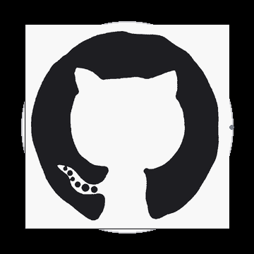

# `while(!done) { learn(); build(); }` 

<table>
<tr>
<td width="40%" align="center">

</td>

<td width="60%">

I'm Arijeet, a Computer Science and Artificial Intelligence student at IIT Lucknow.

I enjoy exploring **Deep Learning and AI**, building practical
applications, and contributing to open-source projects.

I also spend a lot of time solving competitive programming
problems and continuously improving my problem-solving skills.

 

`Learn. Build. Solve. Contribute.`

</td>
</tr>
</table>

---

## 🛠️ Tech Stack:

---

## 🚀 What I Work On

---

## 📚 Currently Learning

- Deep Learning
- Open-Source Contribution
- Flutter
- DevOps
- Competitive Programming

---

## 🔗 Connect With Me

&nbsp;&nbsp;&nbsp;&nbsp;

